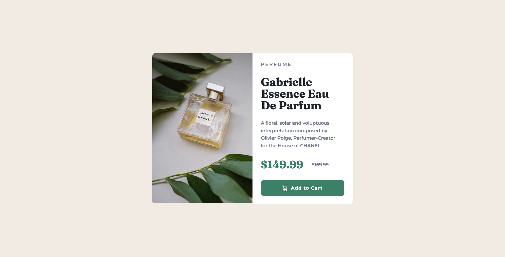
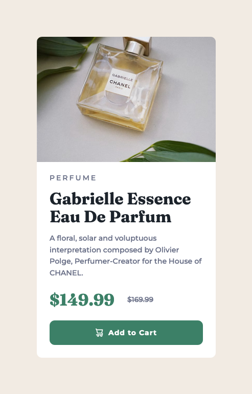

# Frontend Mentor - Product preview card component solution

This is a solution to the [Product preview card component challenge on Frontend Mentor](https://www.frontendmentor.io/challenges/product-preview-card-component-GO7UmttRfa). Frontend Mentor challenges help you improve your coding skills by building realistic projects. 

## Table of contents

- [Overview](#overview)
  - [The challenge](#the-challenge)
  - [Screenshot](#screenshot)
  - [Links](#links)
- [My process](#my-process)
  - [Built with](#built-with)
  - [What I learned](#what-i-learned)
  - [Continued development](#continued-development)
- [Author](#author)

## Overview

### The challenge

Users should be able to:

- View the optimal layout depending on their device's screen size
- See hover and focus states for interactive elements

### Screenshot




### Links

- Solution URL: [Add solution URL here](https://your-solution-url.com)
- Live Site URL: [Add live site URL here](https://your-live-site-url.com)

## My process

### Built with

- Semantic HTML5 markup
- CSS custom properties
- Flexbox
- CSS Grid

### What I learned

I learned more about creating mobile versions using media query

```css
@media screen and (max-width: 700px) {
.container-main {
    flex-direction: column;
}
.img-desktop {
    display: none;
}
.img-mobile {
    display: block;
    min-width: 350px;
}
.container-right {
    width: 350px; 
    display: flex;
    justify-content: space-evenly;
    padding: 25px;
    padding-top: 15px;
}
.container-right div {
    padding: 7px 0;
}
.heading {
    font-size: 16px;
}
.subtitle {
    font-size: 14.3px;
}
.cost-one, .cost-two {
    padding: 7px 0 13px 0;
}
}
```

### Continued development

Continuing to learn flex

## Author

- Frontend Mentor - [@yourusername](https://www.frontendmentor.io/profile/jbedville)
